# Project File Structure

| # | File Name | Screenshot |
|---|-----------|------------|
| 1 | Frontend | 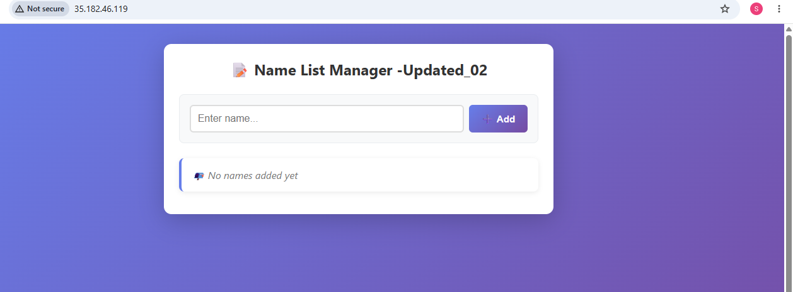 |
| 2 | Frontend_database | 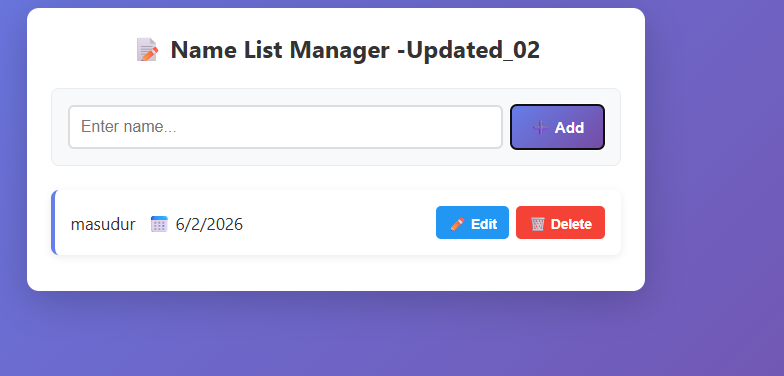 |
| 3 | Github_action | 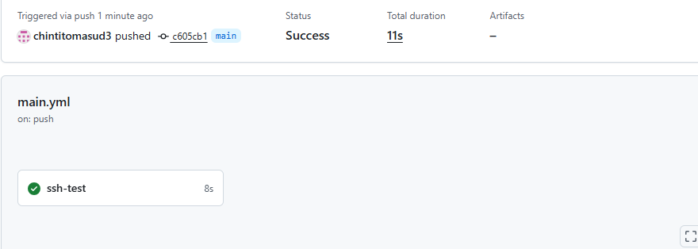 |
| 4 | github_action_status | 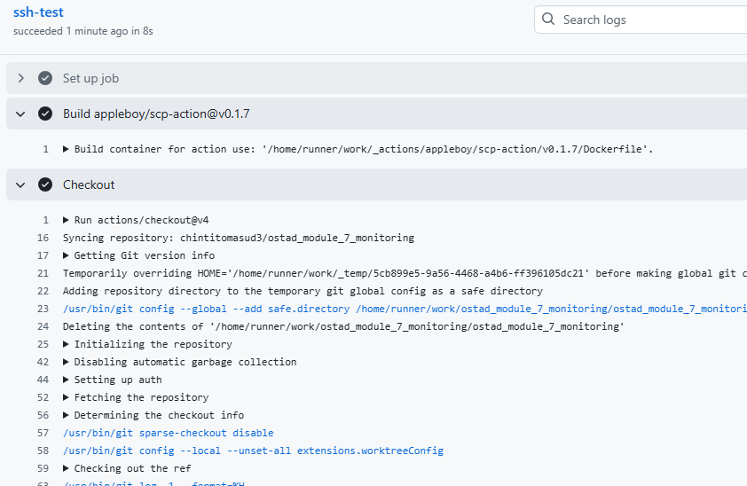 |
| 5 | grafana_dashboard | 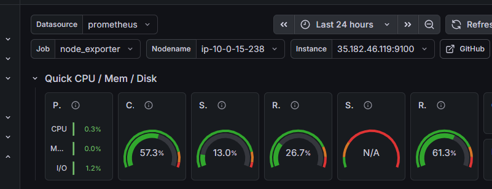 |
| 6 | Grafana_install | 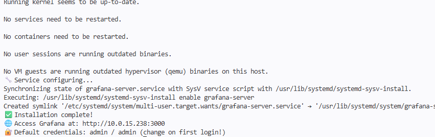 |
| 7 | grafana_storage | 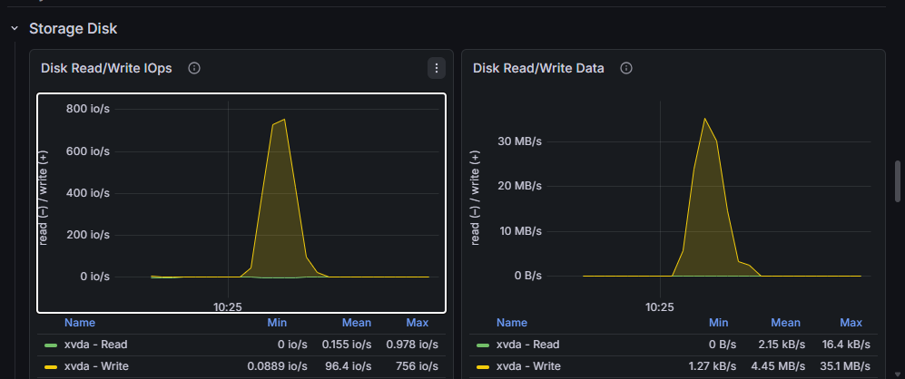 |
| 8 | node_exporter_data | 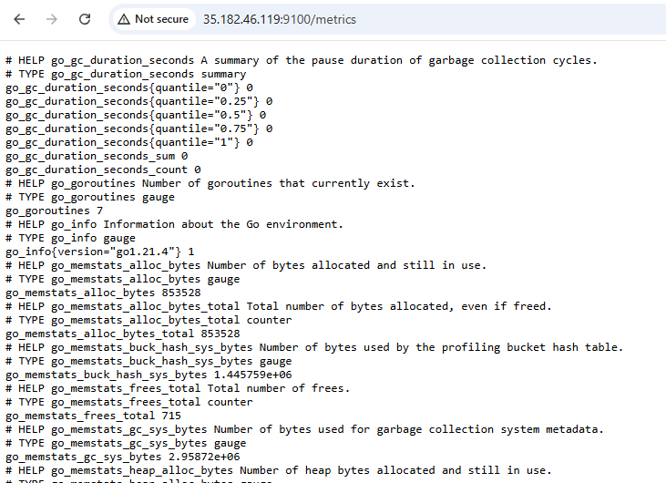 |
| 9 | node_exporter_install | 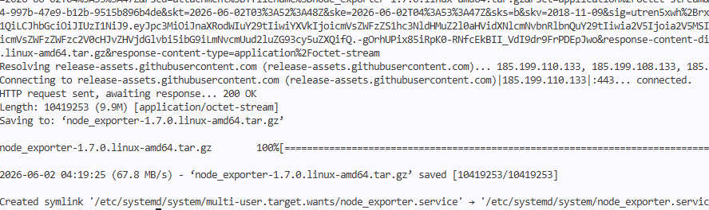 |
| 10 | Prometheus_dashboard | 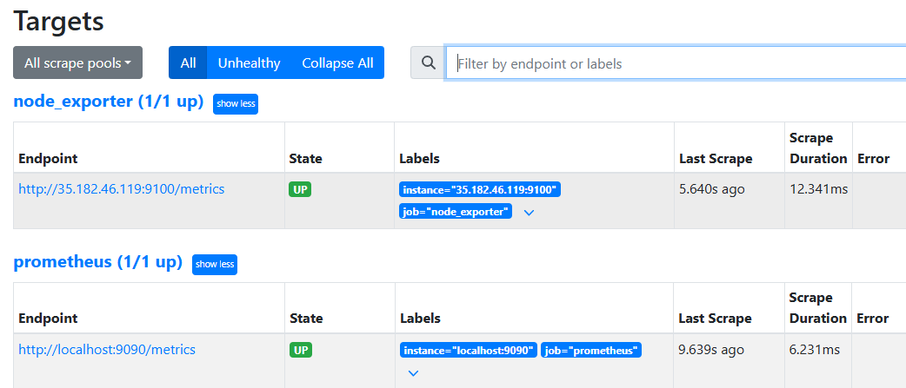 |
| 11 | prometheus_install | 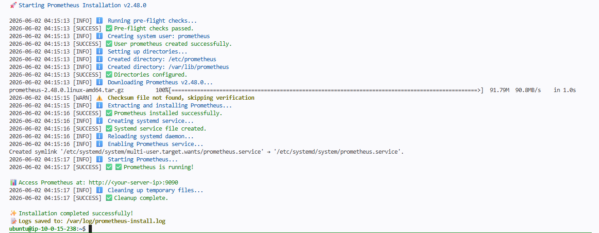 |
| 12 | prometheus_running | 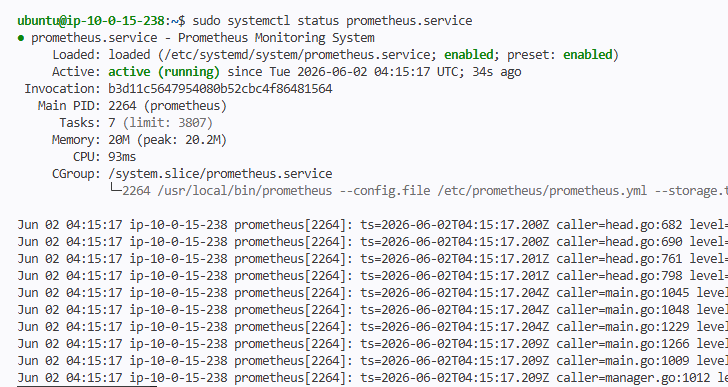 |
